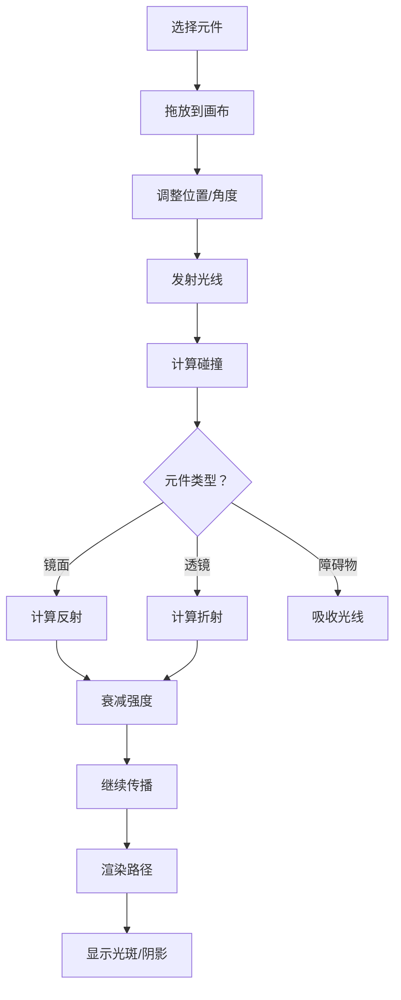

## 1. 产品概述

2D光线追踪演示应用，通过可视化方式展示几何光学原理。用户可在画布上自由放置和拖动光源、镜面、透镜和物体，实时观察光线的反射、折射路径，以及阴影和光斑效果。

- 面向学生、教育工作者和光学爱好者，提供直观的光学原理学习工具
- 通过交互式实验帮助用户理解光的传播、反射、折射定律

## 2. 核心功能

### 2.1 功能模块

1. **主画布**：光学实验场景，支持元件拖放、选择、旋转和删除
2. **元件工具栏**：提供可放置的光学元件（光源、镜面、透镜、障碍物）
3. **属性面板**：调整选中元件的参数（角度、折射率、反射率等）
4. **光线追踪引擎**：实时计算并渲染光线路径、强度、阴影和光斑

### 2.2 页面详情

| 页面名称 | 模块名称 | 功能描述 |
|-----------|-------------|---------------------|
| 主页面 | 元件工具栏 | 光源、矩形镜面、凸透镜、凹透镜、不透明物体 |
| 主页面 | 主画布 | Canvas渲染区域，支持元件拖放、旋转、缩放 |
| 主页面 | 属性面板 | 显示选中元件属性，支持参数调节 |
| 主页面 | 控制面板 | 全局设置（光线数量、最大反射次数、显示网格等） |

## 3. 核心流程

用户从工具栏选择光学元件，拖放到画布上。系统实时从光源发射多条光线，遇到镜面发生反射，遇到透镜发生折射，遇到不透明物体被吸收。每条光线的路径根据强度以不同颜色渲染，最终在画布上显示阴影区域和光斑效果。

## 4. 用户界面设计

### 4.1 设计风格

- **主色调**：深色背景（#0a0a1a）营造物理实验室氛围，霓虹色系用于光线渲染
- **辅助色**：青色（#00f5ff）用于高亮和交互，琥珀色（#ffaa00）用于光源和警告
- **按钮风格**：圆角玻璃拟态按钮，带微光边框
- **字体**：标题使用 JetBrains Mono 等宽字体，正文使用现代无衬线字体
- **布局**：左侧工具栏 + 中央画布 + 右侧属性面板的三栏布局
- **视觉效果**：光线采用辉光渲染，元件边缘带发光效果

### 4.2 页面设计概述

| 页面名称 | 模块名称 | UI元素 |
|-----------|-------------|-------------|
| 主页面 | 元件工具栏 | 垂直图标工具栏，悬停放大，选中发光 |
| 主页面 | 主画布 | 深色星空背景，网格线，光线辉光效果 |
| 主页面 | 属性面板 | 半透明玻璃卡片，滑块控件，数值输入 |
| 主页面 | 控制面板 | 底部浮动面板，开关和滑块 |

### 4.3 响应式

桌面端优先设计，画布区域自适应窗口大小。移动端简化为顶部工具栏 + 全屏画布 + 底部弹出属性面板。
