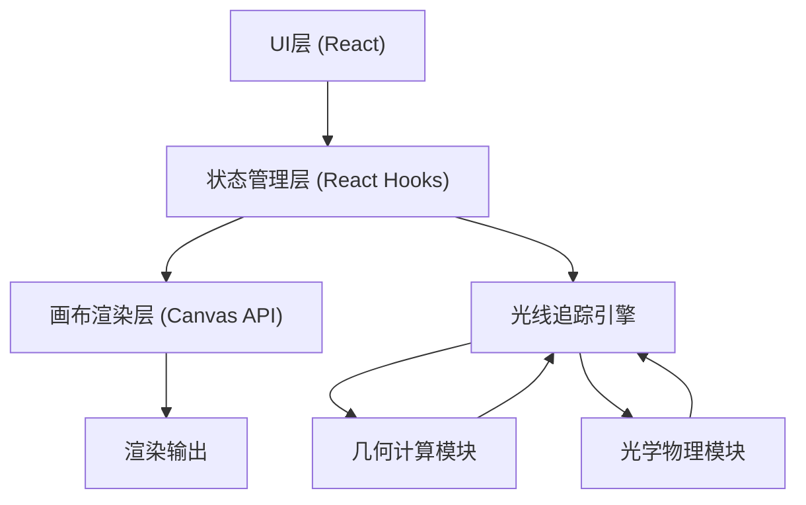

## 1. 架构设计



## 2. 技术描述

- **前端框架**：React@18 + TypeScript
- **构建工具**：Vite@5
- **样式方案**：TailwindCSS@3
- **画布渲染**：原生 Canvas 2D API（无需额外依赖，性能最优
- **状态管理**：React useState/useReducer（轻量场景无需额外状态库
- **包管理**：npm

## 3. 核心模块设计

### 3.1 几何计算模块 (`src/engine/geometry.ts
- 点、向量、线段、圆等基础几何类型
- 线段相交检测算法
- 向量运算（点积、叉积、归一化、反射、折射）

### 3.2 光学物理模块 (`src/engine/physics.ts`)
- 反射定律计算
- 斯涅尔定律（折射定律）计算
- 光线强度衰减模型

### 3.3 光线追踪引擎 (`src/engine/raytracer.ts`)
- 光线发射与传播
- 碰撞检测与分派
- 递归反射/折射（最大深度限制）
- 光线路径记录

### 3.4 光学元件模型 (`src/elements/`)
- LightSource: 光源（点光源、方向光）
- Mirror: 矩形镜面
- Lens: 凸透镜/凹透镜
- Obstacle: 不透明障碍物

### 3.5 画布交互 (`src/hooks/useCanvasInteraction.ts)
- 鼠标事件处理
- 元件拖放
- 旋转手柄
- 框选与多选

## 4. 数据模型

### 4.1 核心类型定义

```typescript
interface Point { x: number; y: number }
interface Vector { x: number; y: number }

interface Ray {
  origin: Point;
  direction: Vector;
  intensity: number;
  wavelength: number;
  bounces: number;
}

interface RaySegment {
  start: Point;
  end: Point;
  intensity: number;
}

type ElementType = 'light' | 'mirror' | 'lens' | 'obstacle';

interface OpticalElement {
  id: string;
  type: ElementType;
  position: Point;
  rotation: number;
  selected?: boolean;
}

interface LightSource extends OpticalElement {
  type: 'light';
  rayCount: number;
  spreadAngle: number;
  color: string;
  intensity: number;
}

interface Mirror extends OpticalElement {
  type: 'mirror';
  width: number;
  reflectivity: number;
}

interface Lens extends OpticalElement {
  type: 'lens';
  width: number;
  thickness: number;
  refractiveIndex: number;
  focalLength: number;
  isConvex: boolean;
}

interface Obstacle extends OpticalElement {
  type: 'obstacle';
  width: number;
  height: number;
}
```

## 5. 性能优化策略

- 使用 requestAnimationFrame 控制渲染循环
- 光线数量限制，避免过多光线导致卡顿
- Canvas 分层：背景层、元件层、光线层
- 离屏 canvas 预渲染静态背景
- 光线追踪算法使用空间索引加速碰撞检测
